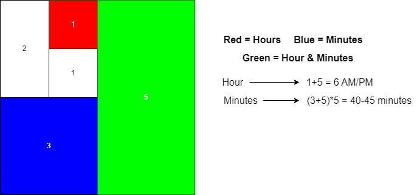
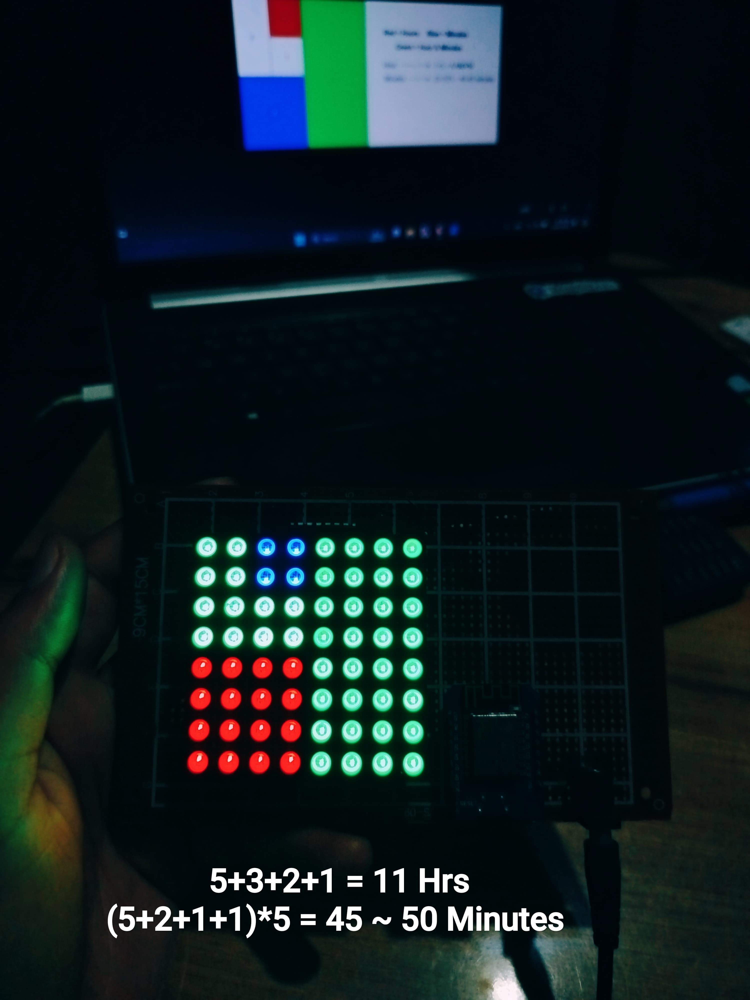

<!-- # fibonacci_clock

A unique clock that uses the Fibonacci sequence to display time with colored squares, combining math and art in an innovative timekeeping design.

## Working

It works by lighing up a segment of the matrix based on the time in the Fibonacci sequence. If the time is 6:42 it will light up the segment **1** and **5** to **RED** which will add to give the hour 6. And for minutes it will light up the segment **3** and **5** to **BLUE** which will add to **8*5** equals to **40** minutes. And since the segment **5** are lit by both the hour and minutes it will change the colour to **GREEN** to show the overlap in the both hour and minutes.

> The segment can only represent between **1 - 12** and to represent the minutes we are multiplying it by 5.
> Since the increments are in every 5 minutes thus the time can be between **40 - 45** Minutes.

Working Image:

 -->

# Fibonacci Clock

A unique clock project that combines **math and electronics** using the Fibonacci sequence to display time with colored segments. Powered by a **Wemos D1 Mini**, it fetches the current time using **NTP**. This repository serves as a **learning journal**, tracking the development process, inspirations, troubleshooting, and future improvements.

---

---

## Repository Structure

- **`images/`**: Photos of the clock and its working principle.
- **`fibonacci_clock_code/`**: Contains the code to run the Fibonacci clock logic.
<!-- - **`References/`**: Resources and ideas that inspired the project.   -->
- **`fibonacci_clock_pcb/`**: Files and documentation for the PCB design.
- **`debugging/`**: Logs of issues encountered and solutions applied during development.
<!-- - **`Inspiration.md`**: Notes on inspirations and design choices, with references for future enhancements. -->

---

## How It Works

The Fibonacci Clock displays time by lighting up segments of a matrix corresponding to Fibonacci numbers.

- **Microcontroller**: Wemos D1 Mini (ESP8266).
- **Time Sync**: Fetches the current time via **NTP** (Network Time Protocol).
- **Hour Representation**:  
  Example: If the time is **6:42**, segments **1** and **5** are lit **RED**, which sum to **6** for the hour.
- **Minute Representation**:  
  For **42 minutes**, segments **3** and **5** are lit **BLUE**, resulting in **(3 + 5) × 5 = 40 minutes**.
- **Overlap**:  
  When a segment represents both hours and minutes (e.g., segment **5**), it is lit **GREEN** to indicate overlap.

**Working Principle Diagram**:  
 

> Segments only represent numbers between **1 - 12**, and minute values are scaled by **multiplying by 5**.  
> Time increments are in 5-minute intervals, so valid minute values range between **40 - 45 minutes**.

---

## The Journey So Far

Building this clock has been an exciting adventure. It started as a simple idea to make a desktop artpiece that is bit unique and looks cool and ended up being a timekeeping device. Using the **Wemos D1 Mini** to sync time with NTP added complexity but opened new possibilities.

 <!-- Handling **network connectivity** and **color overlaps** provided valuable learning experiences. -->

Creating the PCB design was also a journey in its own. I started with the prefboard and the main project is still on the prefboard but for the further development and to make the device look clean and more presentable the [PCB design](fibonacci_clock_pcb/fibonacci_clock_pcb.jpg) was created.

The pcb that I created is not complete. It is still a work in progress and nowhere near to the original design. I am planning to make the project like the main original design itself.

Future iterations may include **offline timekeeping** by integrating an **RTC module** to eliminate reliance on NTP. Wireless control and animations are also on the horizon!

---

## Debugging Log

- **Issue 1**: Incorrect color when hours and minutes overlapped.
  - **Solution**: Modified the RGB blending logic to correctly show GREEN for overlaps.
- **Issue 2**: Incorrect minute calculation when sum exceeded valid range.
  - **Solution**: Added checks to restrict values between 0-12 for valid Fibonacci sums.
- **Issue 3**: The light is not bright enough and flickers a lot.
  - **Solution**: Removed the delay in the main loop to reduce flickering.
    > Just a current solution though. Planning to remove the second solution in the future busing **MAX7219** chip rather than the **LM74HC595** chip.

---

## Future Improvements

- **RTC Integration**: Add an **RTC module** (like DS3231) for offline timekeeping.
- **PCB Enhancements**: Optimize the layout for smaller size and better wiring.
- **Dynamic Patterns**: Add animations or interactive light sequences. There could be much more animations and the rgb led can be used to show some patterns.
- **Battery Power**: Implement battery-powered functionality for portability.

---

## References and Inspirations

- Original inspiration from the [Kickstarter Campaign](https://www.kickstarter.com/projects/basbrun/fibonacci-clock-an-open-source-clock-for-nerds-wit).
- Building process from [Instructables project](https://www.instructables.com/The-Fibonacci-Clock/).
- Video from [Steve Ramsey on Youtube](https://www.youtube.com/watch?v=YIN95L4BdLk) building the clock .

<!-- [The guardian](https://www.theguardian.com/science/alexs-adventures-in-numberland/2015/may/09/fibonacci-clock-can-you-tell-the-time-on-the-worlds-most-stylish-nerd-timepiece) also covered the design of the fibonacci clock. -->

<!-- - Visual design inspired by [Fibonacci Artworks](https://example.com). -->

---

This repository will continue to evolve as I experiment with new features and improvements.
